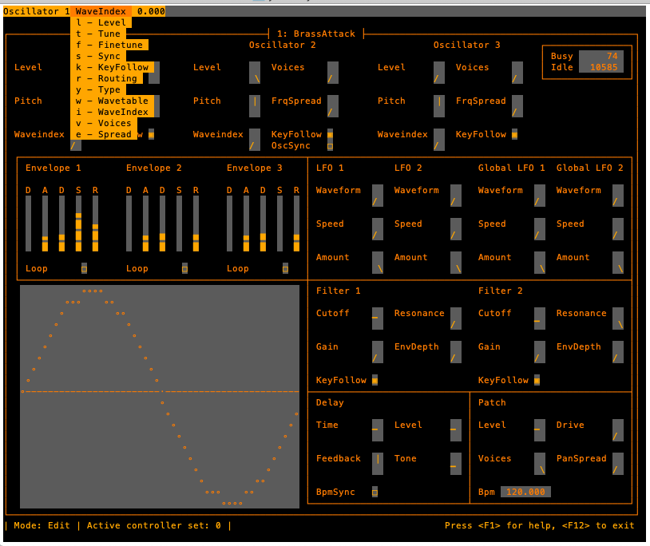

# Yazz - Yet Another Software Synth

Yazz is a subtractive synth written in Rust. It comes with a simple terminal
UI that allows all parameters to be edited by key sequences and/ or MIDI
controllers.

The main focus of this project is on mouse-free editing: Yazz is a synth for
terminal lovers.

This is still work in progress. The sound engine works, but some features are
missing, and the parameter ranges are not perfectly balanced yet.

## Features

- 3 wavetable oscillators per voice, 32 voice polyphony
- Up to 7 instances per oscillator with frequency spreading
- Oscillator sync
- 2 independent filters with individual oscillator routing
  (parallel, serial, bypassed)
- Wavetable scanning
- User wavetable import
- Voice stereo spreading
- Up to 16 modulation assignments to almost all sound parameters
- 2 LFOs per voice plus 2 global LFOs
- 3 ADSR envelopes per voice, with adjustable slope
- Delay (mono or ping pong, BPM-synced)
- 36 sets of MIDI controller assignments

For a detailed description, have a look at the [manual in the doc folder](doc/manual.md).

## Compiling, running and troubleshooting

Yazz should run on both MacOS and Linux. Assuming you have the Rust toolchain
installed, a simple `cargo build --release` should download all dependencies
and compile the synth.

Make sure to build and run the release version, otherwise the audio engine
might have performance problems (it's not optimized yet).

For Linux, the dev-package for ALSA needs to be installed (usually
libasound2-dev or alsa-lib-devel, see https://github.com/RustAudio/cpal for
more infos).

Yazz connects to MIDI port 0 per default. If you get a MIDI port error on
startup, or if Yazz doesn't react to MIDI messages, try connecting to a
different port with `yazz -m 1`.

Check the documentation for additional command line parameters.

## Near future enhancements

- Chorus
- Multitap delay
- Additional key tuning tables for alternate tunings
- Additional oscillators (PM, FM)
- Editing via MIDI note commands

## Far away future enhancements

- Optional GUI
- Implement VST plugin interface
